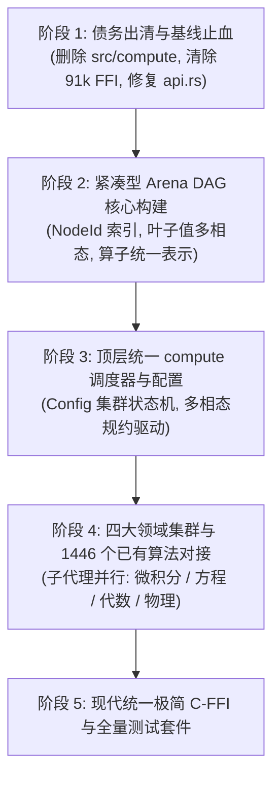

# RSSN 全面架构重构与迁移计划（Unified Identity Operator Architecture Plan）

## 1. 核心愿景与架构原则

### 1.1 核心范式：算法即恒等变换算子（Identity Transformation Operator）
在统一的科学计算哲学中，**数值计算与符号计算在本体论上完全平等，全部都是恒等变换算子**。
- 数学等价关系：$\text{Operator}(\text{Args}) \equiv \text{Result}$。
- 差异仅在于**规约的目标结果相态（Result Representation Domain）**：
  - **符号相态（Symbolic Closed-Form）**：闭式解析表达式、化简公式、形式幂级数。
  - **数值/张量相态（Numerical Tensor / Float Scalar）**：浮点标量、高维稠密张量（`ndarray`/`nalgebra`）、离散时间轨迹网格。
  - **精确代数相态（Exact Algebraic）**：有理数 `BigRational`、多项式环基底、有限域元素。
- 存量的 1,446 个算法（如 RK4、Gauss-Kronrod、Risch、Buchberger、QR 分解）不需要重新发明，而是全部重构为算子在特定目标相态下的**恒等变换规约内核（Reduction Kernels）**。

### 1.2 内存防线：严格的 Hash-Consed DAG，绝对杜绝 AST
- 在高阶导数、张量缩并、多项式因式分解中，树状 AST 会导致 $O(2^n)$ 组合爆炸。
- 整个计算核心生命周期必须**严格保持为紧凑的 DAG 拓扑（Directed Acyclic Graph）**。
- 任意等价子图在内存中只存一份，操作算子构建时间与内存分配开销恒为 $O(1)$。

### 1.3 战略方针：彻底拥抱 Breaking Changes
- **Rust API 与 C-FFI 全面 Breaking**：不为历史包袱妥协。
- 彻底物理移除失效、冗余的 `src/compute` 模块（包含 Mock 线程睡眠调度器）。
- 彻底废除并移除 `src/ffi_apis/` 中 91,258 行机械重复的过程式 C-FFI 包装，后续仅暴露基于 `compute(op, config)` 的极简统一 C-FFI（少于 1,000 行）。

---

## 2. 目标 API 规范

```rust
// 1. 配置规约管线（领域集群 + 目标结果相态）
let config = Config::default()
    .with_calculus()      // 激活连续分析与微积分算子群
    .with_ode()           // 激活常微分方程算子群
    .target_numerical(Tolerance::Absolute(1e-7)); // 目标结果相态：数值收敛

// 2. 构造未求值恒等算子表达式 (O(1) 内存加入 DAG)
let op_diff = d(sin(x) * cos(x), x).at(x, 0.0);
let op_ode  = ode(d(y, t) + 2.0 * y, y, t).with_initial_condition(t, 0.0, 1.0);

// 3. 统一入口驱动计算
let res_diff = compute(op_diff, &config)?; // 输出 DAG 数值常量节点: ScalarFloat(1.0)
let res_ode  = compute(op_ode, &config)?;  // 输出 DAG 离散时序轨迹节点: Trajectory(...)
```

---

## 3. 分阶段实施路线图（5 大阶段）



### 阶段 1：历史债务出清与基线止血
- [ ] **1.1 物理删除 `src/compute/` 目录**：
  - 清理包含 Mock `thread::sleep` 调度器的 1,071 行无用代码。
  - 清理 `Cargo.toml` 和 `src/lib.rs` 中的 `compute` feature 声明与导出。
  - 移除对应集成测试 `tests/compute_*_test.rs`。
- [ ] **1.2 解除 91,258 行旧 C-FFI 捆绑**：
  - 暂时禁用或物理删除 `src/ffi_apis/` 中散落各处的机械导出代码，消除对编译和重构的硬性约束。
- [ ] **1.3 根除 `src/symbolic/core/api.rs` 的 AST 退化风险**：
  - 彻底撤销将构造函数回退为 `Expr::$op(Arc::new(...))` 的代码，确立所有表达式构造必须收口于 DAG Hash-Consing。

### 阶段 2：紧凑型 Arena DAG 内存核心构建
- [ ] **2.1 构建高性能无锁/本地化的 `DagArena`**：
  - 废弃全局粗粒度读写锁单例，引入基于 32 位整数 `NodeId` 的紧凑节点表示：
    ```rust
    pub struct DagNode {
        pub op: OpKind,
        pub children: SmallVec<[NodeId; 4]>,
        pub hash: u64,
    }
    ```
- [ ] **2.2 统一多相态终端值（Terminal Value Nodes）**：
  - `Variable(SymbolId)`
  - `ScalarFloat(f64)`, `ScalarRational(BigRational)`, `ScalarBigInt(BigInt)`
  - `Tensor(Arc<ndarray::ArrayD<f64>>)`
  - `DiscreteTrajectory(Arc<TrajectoryData>)`
  - `Polynomial(Arc<PolynomialData>)`
- [ ] **2.3 规范一等公民的未求值算子（Operator Nodes）**：
  - 微分算子：`Derivative { var: SymbolId }`
  - 积分算子：`Integral { var: SymbolId }`
  - 方程算子：`Solve { target: SymbolId }`、`Ode { func: SymbolId, var: SymbolId }`
  - 矩阵算子：`Eigenvalues`、`Svd`、`Inverse`、`MatrixMul`
  - 变换算子：`FourierTransform`、`LaplaceTransform`
  - 物理与变分算子：`EulerLagrange`、`Commutator`

### 阶段 3：顶层统一配置器与 `compute` 调度管线
- [ ] **3.1 实现领域集群配置器 `ComputeConfig`**：
  - 链式开启规则集群：`.with_calculus()`, `.with_ode()`, `.with_algebra()`, `.with_linear_algebra()`, `.with_physics()`, `.with_stats()`。
  - 显式配置目标结果相态：`.target_symbolic()`, `.target_numerical(Tolerance)`, `.target_exact()`。
- [ ] **3.2 实现顶层纯函数计算调度器**：
  - `pub fn compute(expr: NodeId, config: &ComputeConfig) -> Result<NodeId, ComputeError>`。
  - 内部利用 E-Graph 或 DAG 饱和循环，根据 `config` 中的目标相态驱动规约内核。

### 阶段 4：四大多领域集群算法对接（可多子代理并行）
将存量的 78 个模块、1,446 个具体算法函数作为规约内核平移对接：

- **子代理 A：连续分析集群（Continuous Analysis & Calculus）**
  - 模块：`calculus`, `vector_calculus`, `differential_geometry`, `calculus_of_variations`, `complex_analysis`, `transforms`, `integral_equations`
  - 符号内核：Leibniz 求导、Risch 积分、留数定理、形式级数展开。
  - 数值内核：有限差分、双数自动微分、Gauss-Kronrod 求积、数值 FFT/Chirp-Z。
- **子代理 B：方程与动力系统集群（Equations & Dynamical Systems）**
  - 模块：`solve`, `real_roots`, `ode`, `pde`, `convergence`, `fractal_geometry_and_chaos`
  - 符号内核：分离变量、积分因子、Sturm 根隔离、特征线法。
  - 数值内核：Runge-Kutta 4/45、BDF 刚性积分器、Newton-Raphson、Broyden 拟牛顿法。
- **子代理 C：代数与线性代数集群（Algebra & Linear Algebra）**
  - 模块：`matrix`, `sparse`, `tensor`, `polynomial`, `grobner`, `cas_foundations`, `radicals`, `geometric_algebra`
  - 符号内核：伴随矩阵、符号特征多项式、Buchberger Gröbner 基、根式反套。
  - 数值内核：Faer/LAPACK 驱动的 SVD、QR、Cholesky 分解、稀疏 Krylov (CG/GMRES)。
- **子代理 D：离散、统计与物理前沿仿真集群（Discrete, Stats & Physics）**
  - 模块：`stats`, `optimize`, `quantum_mechanics`, `physics_sim`, `group_theory`, `logic`, `cad`
  - 符号内核：正则换位子对易、CAD 柱形分解、母函数展开。
  - 数值内核：L-BFGS 极值优化、FDTD 网格更新、Navier-Stokes 有限体积步进。

### 阶段 5：极简现代 C-FFI 重建与回归套件验证
- [ ] **5.1 极简 C-FFI（少于 1000 行）**：
  - `rssn_config_new()`, `rssn_config_with_calculus()`, `rssn_config_target_numerical()`
  - `rssn_op_diff()`, `rssn_op_ode()`, `rssn_op_integral()`
  - `rssn_compute(expr_id, config)`
  - `rssn_extract_float()`, `rssn_extract_tensor()`, `rssn_extract_symbolic_string()`
- [ ] **5.2 统一端到端双轨测试**：
  - 针对每个算子编写双相态测试（例如微分算子：验证解析输出为符号导数式，数值输出为精确浮点数）。
